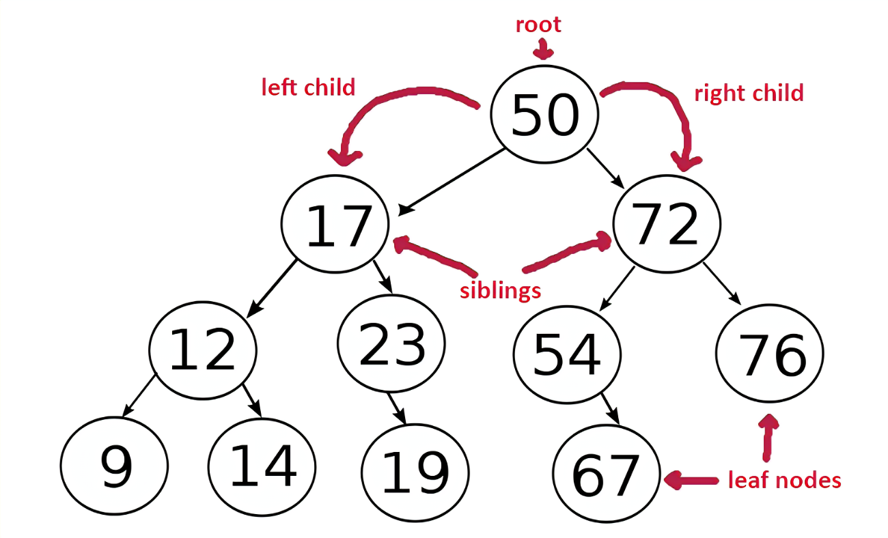

# Trees
Trees are a data structure with nodes that contain a value and links to other nodes that contain a relation ship to that node. 

## Binary Tree
Figure 1 below shows just one type of a tree, a binary tree. In this image each node (circles) can have up to 3 links (black arrows). 2 links of each node can be to there child, while 1 can be to there parent. All nodes that are linked to a child node are considered parents, even if they are the child of another node. The leaf node are the ones with no children. The tree represented in this image is a binary tree because it contains nodes that have no more than 2 children, one child that is "less" and one child that is "more." Less and more is important because it means that to find a value in a tree you can start at the root and then compare the value to the node value, if the value you're looking for is more that the load value you can do the same comparison on it's right child, or it's left child if the value is less. By doing this until you value equals the node value, or there is no child, you can efficiently check or add values without checking every element.


*Figure 1 (from alytech.com)*

## Definitions

* __Root Node__ - The only node with no parent.
* __Parent Node__ - Any node with a child.
* __Child Node__ - A node that is linked to a parent node.
* __Leaf Node__ - A node with no children.

## Example

```python
class BinaryTree:

    class Node:
        
        def __init__(self, value):
            self.value = value
            self.left = None
            self.right = None
    
    def __init__(self):
        self.root = None

    def add(self, value):
        node_to_add = self.Node(value)
        if self.root == None:
            self.root = node_to_add
            return
        
        self._add(self.root, node_to_add)

    def _add(self, node, new_node):
        
        if node.value > new_node.value:
            if node.right is None:
                node.right = new_node
            else:
                self._add(node.right)

        if node.value < new_node.value:
            if node.left is None:
                node.left = new_node
            else:
                self._add(node.left)        
        
    def contains(self, value):
        return self._contains(self.root, value)

    def _contains(self, node, value):
        
        if node.value == value:
            return True
        
        if node.value > value:
            if node.right is None:
                return False
            return self._contains(node.right, value)

        if node.value < value:
            if node.left is None:
                return False
            return self._contains(node.left, value) 

bt = BinaryTree()

bt.add(10)
bt.add(12)
bt.add(9)

print(bt.contains(9))
print(bt.contains(10))
print(bt.contains(11))
print(bt.contains(12))
```

## Problem for you to Solve

Using both sets and a tree, make conflict resolution more efficient than possible using only sets.

The code outline for the problem can be found [here](problems/trees_problem.py). It is pretty long so I won't include it here. You will be adding code to both the _add() and _contains() class to get it to work with CustomSet class.

If you want a greater challenge, modify the example code above to work with the CustomSet class you made, or the [solution](solutions/set_solution.py) for the last chapter. [This file](problems/trees_solution_test.py) contains the example cases.

I get the following output:
```
list_init_time=0.05065710000000001
tree_init_time=0.7590272
set_init_time=0.0255533
--------------------
list_count_time=6.2232077
tree_count_time=0.04839699999999958
set_count_time=0.002407099999999218
--------------------
set_tree.node_count=6083
set_tree.value_count=95282

len(slow_list)=100000

fast_set.value_count=1000
--------------------
```

The combination of the tree and set is still slower than a set alone. In theory though, large databases, such as a user database for a website, should benefit from it as it increases the efficiency of conflicts from O(n) to O(log n). It is also possible that I made a mistake and there is a bug somewhere.

Thank for reading through this tutorial about data structures in python!